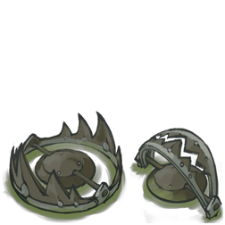

<p align="center">
<div style="width:150px;margin:auto;">
<svg viewBox="0 0 261 226"><path d="M161.096.001l-30.225 52.351L100.647.001H-.005l130.877 226.688L261.749.001z" fill="#41b883"/><path d="M161.096.001l-30.225 52.351L100.647.001H52.346l78.526 136.01L209.398.001z" fill="#34495e"/></svg>
</div>
</p>
<h1 align="center">SSY-UI-VITE</h1>
<p align="center">
  基于 Vite 栈的前端工程化实践
</p>

<P align="center">

</p>


<a href="https://codecov.io/gh/45mx/ssy-ui-vite" >
 
 </a>

## Features
 - 基于 Vue 框架
 - 支持 JSX 与 Vue 单文件组件
 - Jest + Vue3 plugins实现单元测试
 - Eslint + Prettier + Husky 语法检查
 - 采用 Rollup 构建
 - Vitepress + Vercel 文档网站搭建
 - 基于Action CI 实现持续集成与交付

## Install
```bash
 npm i ssy-ui-vite
 ```

 ## Quick Start
 ```bash
  import Vue from 'vue'
  import SSYUI from 'ssy-ui'

  const App = {
        template: `
            <SButton color='blue'>主要按钮</SButton>
        `,
  };

  createApp(App)
    .use(SSYUI)
    .mount("#app");
```

 ## Quick Start
    如果希望尽快上手，可以访问[Getting Started](https://ssy-ui-vite-eight.vercel.app/)

 ## 欢迎提PR
 一起加入项目
  一起加入项目1
